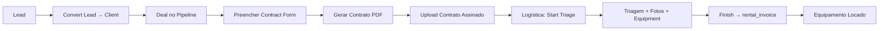

# RentDesk Backend — Referência para o Frontend

> Documento de contexto para IAs e desenvolvedores do frontend integrarem com este backend.
> Última atualização baseada no código em `src/`.

---

## 1. O que é o RentDesk

**RentDesk** é o backend de um ERP para empresas de **locação de equipamentos** (ex.: plataformas elevatórias, máquinas). Centraliza:

| Módulo | Responsabilidade |
|--------|------------------|
| **Operacional** | Equipamentos, peças, ordens de serviço (manutenção) |
| **Financeiro** | Faturas de locação, conciliação bancária, exportação XLSX |
| **Comercial (CRM)** | Leads, contatos, pipeline de vendas, negociações, contratos |
| **Logística** | Triagem pós-assinatura de contrato → gera fatura de locação |
| **RH** | Cargos, documentos, ponto, férias, EPI, treinamentos, integrações |
| **Usuários** | Perfis, níveis de acesso, primeiro acesso / pré-cadastro |

O frontend autentica via **Supabase Auth** e consome esta API REST. O backend usa o JWT do usuário para respeitar **RLS (Row Level Security)** do Supabase na maioria das operações.

---

## 2. Stack e execução

| Item | Valor |
|------|-------|
| Runtime | Node.js + TypeScript |
| Framework | Express 5 |
| Banco / Auth | Supabase (PostgreSQL + Auth + Storage) |
| Porta padrão | `3001` (`PORT` no `.env`) |
| Dev | `npm run dev` → `ts-node-dev src/app.ts` |
| Build | `npm run build` → `dist/` |
| Prod | `npm start` → `node dist/app.js` |

### Variáveis de ambiente (`.env`)

```
PORT=3001
SUPABASE_URL=
SUPABASE_ANON_KEY=
SUPABASE_SERVICE_ROLE_KEY=
```

O **service role** é usado apenas em operações administrativas (pré-cadastro, reset de senha, bypass pontual de RLS, upload de exports).

---

## 3. Estrutura do projeto

```
rentdesk-backend/
├── src/
│   ├── app.ts                 # Entry point, rotas, middlewares
│   ├── config/
│   │   └── supabase.ts        # Clientes Supabase (anon, admin, user JWT)
│   ├── middleware/
│   │   └── auth.ts            # authenticate + authorize(roles)
│   ├── routes/                # Definição de rotas por módulo
│   ├── controllers/           # Lógica de negócio + queries Supabase
│   └── types/                 # Tipos TypeScript (equipment, crm)
├── package.json
├── tsconfig.json
└── PROJECT_REFERENCE.md       # Este arquivo
```

**Padrão arquitetural:** `app.ts` → `routes/*` → `controllers/*` → Supabase.

---

## 4. Autenticação e autorização

### 4.1 Fluxo de autenticação

1. O **frontend** faz login no Supabase Auth e obtém um `access_token` (JWT).
2. Todas as rotas protegidas enviam: `Authorization: Bearer <token>`.
3. O middleware `authenticate`:
   - Valida o token com `supabase.auth.getUser(token)`
   - Busca perfil em `users_profiles`
   - Rejeita se `active === false`
   - Anexa em `req`: `user`, `profile`, `token`

### 4.2 Rotas públicas (sem token)

| Método | Rota | Descrição |
|--------|------|-----------|
| GET | `/health` | Health check |
| POST | `/api/auth/check-email` | Verifica se e-mail pode fazer primeiro acesso |
| POST | `/api/auth/complete-signup` | Define senha no primeiro acesso |

### 4.3 Primeiro acesso (signup)

```
Admin pré-cadastra → POST /api/users/pre-register (auth)
Usuário abre app → POST /api/auth/check-email { email }
  → authorized: true se active=true e password_set=false
Usuário define senha → POST /api/auth/complete-signup { email, password, full_name? }
Login normal via Supabase Auth no frontend
```

### 4.4 Níveis de acesso (`users_profiles.access_level`)

Valores usados no código (podem coexistir — atenção a inconsistências):

| Nível | Uso típico |
|-------|------------|
| `Administrador` | CRM delete, contratos, RH |
| `Admin` | Usado em `clientRoutes` (create/delete) — **possível divergência com `Administrador`** |
| `Diretoria` | Dashboard admin, delete contrato CRM |
| `Gerente` | Dashboard admin, CRM, RH, clientes |
| `Gestor` | Delete contatos CRM |
| `Comercial` | Dashboard comercial, CRM restrito ao owner |
| `Recursos Humanos` | Folha de ponto, aprovações |
| `Usuário` | Fallback padrão |

### 4.5 Dashboard por perfil

- `access_level === 'Comercial'` → dashboard comercial (tarefas CRM, deals fechados, leads, atividades)
- Demais → dashboard administrativo (KPIs financeiros, frota, receita 6 meses)

---

## 5. Convenções da API

### Headers

```
Authorization: Bearer <supabase_access_token>
Content-Type: application/json
```

### Respostas de erro comuns

| Status | Significado |
|--------|-------------|
| 401 | Token ausente ou inválido |
| 403 | Perfil inativo, sem permissão ou perfil não encontrado |
| 404 | Recurso não encontrado |
| 400 | Validação de negócio |
| 500 | Erro interno (`{ error: string }`) |

### Paginação (apenas `/api/rentals`)

Query: `page` (default 1), `limit` (default 15, max 100).

Resposta:
```json
{
  "data": [],
  "total": 0,
  "page": 1,
  "limit": 15,
  "totalPages": 0,
  "stats": {
    "pendingReconciliationCount": 0,
    "monthlyReceivedTotal": 0
  }
}
```

---

## 6. Referência completa de endpoints

Base URL: `http://localhost:3001` (ou `PORT` configurada).

### 6.1 Auth (público)

#### POST `/api/auth/check-email`
```json
// Request
{ "email": "usuario@empresa.com" }

// Response — autorizado
{ "authorized": true, "profile": { "id", "full_name", "email" } }

// Response — não autorizado
{ "authorized": false, "message": "..." }
```

#### POST `/api/auth/complete-signup`
```json
// Request
{ "email": "...", "password": "min 6 chars", "full_name": "opcional" }

// Response
{ "success": true }
```

---

### 6.2 Usuários — `/api/users` (auth)

| Método | Rota | Descrição |
|--------|------|-----------|
| GET | `/` | Lista todos os perfis |
| GET | `/me` | Perfil do usuário logado |
| GET | `/:id` | Perfil por ID |
| POST | `/pre-register` | Pré-cadastro (admin cria auth + profile) |
| PUT | `/:id` | Atualiza perfil (`active` também bane/desbane no Auth) |
| POST | `/:id/reset-password` | Envia e-mail de reset; seta `password_set=false` |

**Campos principais de `users_profiles`:** `id`, `email`, `full_name`, `role_title`, `access_level`, `cpf`, `phone`, `photo_url`, `active`, `password_set`, `created_at`, `updated_at`.

---

### 6.3 Clientes — `/api/clients` (auth)

| Método | Rota | Permissão extra |
|--------|------|-----------------|
| GET | `/` | — |
| GET | `/:id` | — |
| POST | `/` | Admin, Diretoria, Gerente |
| PUT | `/:id` | — |
| POST | `/:id/asaas-sync` | — |
| DELETE | `/:id` | Admin, Diretoria, Gerente |

**Tabela:** `clients`

Campos típicos: `company_name`, `cnpj`, `state_subscription`, `contact_name`, `email`, `phone`, `address_*`, `active`, `asaas_customer_id`.

`POST /:id/asaas-sync` cria/sincroniza o cliente como customer no Asaas (usando a `erp_company_settings.asaas_api_key` ativa) e grava o id retornado em `clients.asaas_customer_id`.

---

### 6.4 Equipamentos — `/api/equipments` (auth)

CRUD completo. **Tabela:** `equipments`

```typescript
// Status possíveis
'Disponível' | 'Locado' | 'Em Manutenção' | 'Inativo'
```

Campos: `asset_number`, `name`, `type`, `model`, `serial_number`, `height`, `status`, `manufacture_year`, `value`, `unit`, `photo_url`, `notes`.

**Efeitos colaterais automáticos:**
- Locação criada/atualizada → status do equipamento muda (`Locado` / `Disponível`)
- OS criada → `Em Manutenção`
- OS concluída/cancelada → `Disponível`
- Logística finaliza triagem → `Locado`

---

### 6.5 Locações / Faturas — `/api/rentals` (auth)

Representa faturas de locação. **Tabela:** `rental_invoices`

| Método | Rota | Notas |
|--------|------|-------|
| GET | `/` | Paginado + filtros |
| GET | `/:id` | Detalhe |
| POST | `/` | Calcula `total_value` automaticamente |
| PUT | `/:id` | Recalcula total se custos mudarem |
| DELETE | `/:id` | 204 |

**Query params (GET `/`):**
`search`, `billing_status`, `reconciliation_status`, `date_from`, `date_to`, `value_min`, `value_max`, `page`, `limit`

**Campos de custo (somados em `total_value`):**
`cost_rental`, `cost_insurance`, `cost_freight`, `cost_rcd`, `cost_third_party`, `cost_training`

**Outros campos:** `client_id`, `client_name`, `cnpj`, `equipment_id`, `equipment_name`, `equipment_type`, `asset_number`, `work_site`, `billing_period_start/end`, `return_date`, `due_date`, `payment_method`, `billing_status`, `reconciliation_status`, `bank_reconciliation_date`, `invoice_number`, `notes`.

---

### 6.5-bis Pagamentos / Asaas — `/api/payments` (auth)

| Método | Rota | Permissão extra | Notas |
|--------|------|-----------------|-------|
| POST | `/setup/subaccount` | Admin, Diretoria, Gerente | Cria subconta Asaas (via `ASAAS_MASTER_API_KEY`) e grava `apiKey` em `erp_company_settings.asaas_api_key` (linha `active=true`; cria se não existir) |
| POST | `/invoices/:id/charge` | — | Gera cobrança Asaas para uma `rental_invoices`; exige `clients.asaas_customer_id` e `erp_company_settings.asaas_api_key` já preenchidos; grava resultado em `payments` |

**Tabelas envolvidas:** `erp_company_settings` (config única da locadora + `asaas_api_key`), `payments` (`invoice_id`, `client_id`, `asaas_payment_id`, `billing_type`, `value`, `net_value`, `due_date`, `payment_date`, `status`), `asaas_webhook_logs` (dedup por `event_id`, ver `/api/webhooks`).

**Fluxo completo de onboarding:** `POST /setup/subaccount` (1x, gera chave da locadora) → `POST /api/clients/:id/asaas-sync` (por cliente) → `POST /invoices/:id/charge` (por fatura).

Sistema é single-tenant: não há `locadora_id`/tenant em nenhuma tabela — `erp_company_settings` sempre tem uma única linha `active=true`.

---

### 6.6 Peças — `/api/parts` (auth)

CRUD. **Tabela:** `parts`

- POST valida duplicidade por `part_number` / `internal_code`
- Campo `total_value` é ignorado no insert/update (calculado no banco)
- OS consome estoque (`quantity`)

---

### 6.7 Ordens de Serviço — `/api/service-orders` (auth)

**Tabelas:** `service_orders`, `service_order_parts`, `service_order_labor`, `parts`, `equipments`

| Método | Rota | Descrição |
|--------|------|-----------|
| GET | `/` | Lista com parts e labor aninhados |
| GET | `/:id` | Detalhe completo |
| POST | `/` | Cria OS + parts + labor; valida estoque |
| PUT | `/:id` | Atualiza OS; recalcula estoque de peças |
| PATCH | `/:id/status` | `{ "status": "..." }` |
| DELETE | `/:id` | 204 |

**Body POST/PUT (estrutura):**
```json
{
  "...campos da OS...",
  "parts": [
    { "part_id": "uuid", "quantity_used": 1, "unit_value_at_use": 0, "was_used": true }
  ],
  "labor": [
    { "technician_name": "...", "labor_date": "YYYY-MM-DD", "start_time": "HH:mm", "end_time": "HH:mm", "labor_type": "T" }
  ]
}
```

**Status de OS referenciados:** `Concluída`, `Cancelada` (liberam equipamento).

---

### 6.8 Dashboard — `/api/dashboard` (auth)

#### GET `/`
Retorna estrutura diferente por `access_level`:

**Admin (`type: "admin"`):**
```json
{
  "type": "admin",
  "kpis": {
    "currentMonthTotal", "prevMonthTotal", "variation",
    "pendingReconciliationCount", "rentedEquipmentCount", "serviceOrderCount"
  },
  "revenueByMonth": [{ "month", "label", "total" }],
  "fleetStatus": { "disponivel", "locado", "manutencao", "inativo", "total" },
  "recentInvoices": []
}
```

**Comercial (`type: "comercial"`):**
```json
{
  "type": "comercial",
  "tasks": [],
  "closedDeals": { "totalValue", "totalCount", "userValue", "userCount", "userPercentage" },
  "leadSources": [{ "name", "count" }],
  "activities": []
}
```

---

### 6.9 Exportações — `/api/exports` (auth)

| Método | Rota | Descrição |
|--------|------|-----------|
| GET | `/clients` | XLSX de clientes → URL assinada (5 min) |
| GET | `/rentals` | XLSX de locações (mesmos filtros da listagem) |

**Resposta:**
```json
{
  "downloadUrl": "https://...",
  "fileName": "...",
  "expiresIn": 300,
  "totalRecords": 42
}
```

**Storage bucket:** `exports` (paths: `clients/`, `rentals/`)

---

### 6.10 CRM — `/api/crm` (auth)

#### Pipelines
| Método | Rota |
|--------|------|
| GET | `/pipelines` |
| POST | `/pipelines` |
| PUT | `/pipelines/:id` |
| DELETE | `/pipelines/:id` |

POST body exemplo: `{ "name", "description", "stages": [{ "name", "isWon", "isLost", "probability" }] }`

#### Leads
| Método | Rota | Notas |
|--------|------|-------|
| GET | `/leads` | Lista todos (admin bypass RLS) |
| POST | `/leads` | Body pode incluir `contacts[]` |
| PUT | `/leads/:id` | Comercial só edita próprios leads |
| DELETE | `/leads/:id` | Administrador ou Gerente |
| GET | `/leads/:id/contacts` | |
| POST | `/leads/:id/convert` | Cria client + migra contatos |
| GET | `/leads/check-cnpj/:cnpj` | Verifica duplicidade |

**Status lead:** `Novo` | `Em Contato` | `Qualificado` | `Desqualificado` | `Convertido`

**Origem lead:** `Indicação` | `Site` | `Evento` | `Cold Call` | `Rede Social` | `Parceiro` | `Outro`

#### Contatos
| Método | Rota |
|--------|------|
| GET | `/contacts` |
| POST | `/contacts` |
| PUT | `/contacts/:id` |
| DELETE | `/contacts/:id` |

Contato vinculado a `lead_id` e/ou `client_id`.

#### Deals (negociações)
| Método | Rota |
|--------|------|
| GET | `/deals` |
| POST | `/deals` |
| PUT | `/deals/:id` |
| DELETE | `/deals/:id` |
| GET | `/deals/activities` |

Mudança de `stage_id` gera registro em `crm_deal_activities`. Stages com `is_won`/`is_lost` setam `closed_at`.

#### Contratos (por deal)
| Método | Rota | Descrição |
|--------|------|-----------|
| GET | `/deals/:id/contract-form` | Form existente ou template pré-preenchido |
| PUT | `/deals/:id/contract-form` | Salva formulário |
| POST | `/deals/:id/contract/generate` | Gera registro PDF (snapshot) |
| GET | `/deals/:id/contracts` | Histórico de versões |
| POST | `/deals/:id/contract/upload` | Marca contrato assinado |
| DELETE | `/deals/:id/contract/:contractId` | Exclui versão |

**Status contrato:** `Gerado` → upload → `Assinado` → logística → `Triagem` → `Processado` | `Cancelado`

**Upload assinado body:** `{ "contract_id", "file_url" }` (path no bucket `crm-contracts`)

**form_status:** `Rascunho`, `PDF Gerado`, `Pronto para Gerar`

#### Tarefas CRM
| Método | Rota |
|--------|------|
| GET | `/tasks` |
| GET | `/tasks/types` | Alias de task-types |
| GET | `/task-types` | |
| POST | `/tasks` |
| PATCH | `/tasks/:id` |
| DELETE | `/tasks/:id` |

**Status tarefa:** `Pendente` | `Em Andamento` | `Concluída` | `Cancelada`
**Prioridade:** `Baixa` | `Normal` | `Alta` | `Urgente`

---

### 6.11 Logística — `/api/logistics` (auth)

Fluxo pós-contrato assinado:

```
Assinado → PATCH start-triage → Triagem → PATCH finish → Processado (+ cria rental_invoice)
```

| Método | Rota | Descrição |
|--------|------|-----------|
| GET | `/contracts` | Board: status Assinado/Triagem/Processado |
| GET | `/contracts/:id` | Detalhe para triagem |
| PATCH | `/contracts/:id/start-triage` | Assinado → Triagem |
| PATCH | `/contracts/:id/finish` | Triagem → Processado; body: `{ "equipment_id" }` |
| POST | `/contracts/:id/triage-photos` | `{ "position", "label", "file_path" }` |
| GET | `/contracts/:id/triage-photos` | |
| DELETE | `/contracts/:id/triage-photos/:photoId` | |

**Storage bucket triagem:** `logistics-triage`

**Ao finalizar triagem:** cria registro em `rental_invoices` a partir do `crm_deal_contract_forms` e vincula em `crm_deal_contracts.rental_invoice_id`.

---

### 6.12 RH — `/api/hr` (auth)

#### Cargos e níveis
| Método | Rota |
|--------|------|
| GET | `/positions` |
| POST | `/positions` |
| GET | `/positions/:id` |
| PUT | `/positions/:id` |
| GET | `/levels` |
| POST | `/employee-positions` | Troca cargo do colaborador |

#### Colaboradores
| Método | Rota |
|--------|------|
| GET | `/employees` |
| GET | `/employees/:id` |
| PUT | `/employees/:id` |
| GET | `/employees/:id/documents` |

#### Documentos
| Método | Rota |
|--------|------|
| GET | `/document-types` |
| POST | `/document-types` |
| PUT | `/document-types/:id` |
| GET | `/employee-documents` |
| POST | `/employee-documents` |

#### Ponto
| Método | Rota |
|--------|------|
| GET | `/clock-in/today` | Registros do dia + `nextType` |
| POST | `/clock-in` | Próxima batida automática |
| GET | `/employees/:id/time-records` | |
| GET | `/employees/:id/timesheets` | |
| POST | `/employees/:id/timesheets` | RH/Admin gera folha |
| PATCH | `/timesheets/:timesheetId/status` | Colaborador: `Aprovada` ou `Contestada` |

**Sequência de batidas:** `Entrada` → `Saída Almoço` → `Retorno Almoço` → `Saída`

#### Férias
| Método | Rota |
|--------|------|
| GET | `/employees/:id/vacation-requests` |
| POST | `/employees/:id/vacation-requests` |

#### EPI
| Método | Rota |
|--------|------|
| GET | `/epi-catalog` |
| GET | `/employees/:id/epi-records` |
| POST | `/employees/:id/epi-records` |

#### Treinamentos
| Método | Rota |
|--------|------|
| GET | `/trainings/catalog` |
| POST | `/trainings/catalog` |
| PUT | `/trainings/catalog/:id` |
| GET | `/trainings/metrics` |
| GET | `/trainings` |
| POST | `/trainings` |

#### Integrações (NRs, exames)
| Método | Rota |
|--------|------|
| GET | `/integrations/types` |
| POST | `/integrations/types` |
| PUT | `/integrations/types/:id` |
| GET | `/integrations/metrics` |
| GET | `/integrations` |
| POST | `/integrations` |

#### Histórico
| Método | Rota |
|--------|------|
| GET | `/recent-activities` |
| GET | `/position-history` |

---

## 7. Modelo de dados (tabelas Supabase)

### Core operacional
| Tabela | Descrição |
|--------|-----------|
| `equipments` | Frota de equipamentos |
| `clients` | Clientes |
| `parts` | Peças / estoque |
| `service_orders` | Ordens de serviço |
| `service_order_parts` | Peças usadas na OS |
| `service_order_labor` | Mão de obra da OS |
| `rental_invoices` | Faturas de locação |

### Usuários
| Tabela | Descrição |
|--------|-----------|
| `users_profiles` | Perfil estendido (vinculado ao auth.users) |

### CRM
| Tabela | Descrição |
|--------|-----------|
| `crm_leads` | Leads comerciais |
| `crm_contacts` | Contatos (lead e/ou client) |
| `crm_pipelines` | Pipelines de venda |
| `crm_pipeline_stages` | Etapas do pipeline |
| `crm_deals` | Negociações |
| `crm_deal_activities` | Histórico de atividades |
| `crm_tasks` | Tarefas |
| `crm_task_types` | Tipos de tarefa |
| `crm_deal_contract_forms` | Formulário de contrato |
| `crm_deal_contracts` | Versões de contrato geradas/assinadas |
| `erp_company_settings` | Dados da locadora (cláusulas, banco, logo) |

### Logística
| Tabela | Descrição |
|--------|-----------|
| `logistics_triage_photos` | Fotos checklist de triagem |

### RH
| Tabela | Descrição |
|--------|-----------|
| `hr_positions` | Cargos |
| `hr_job_levels` | Níveis salariais |
| `hr_salary_ranges` | Faixas salariais por cargo/nível |
| `hr_employee_positions` | Histórico de cargo do colaborador |
| `hr_document_types` | Tipos de documento |
| `hr_position_document_types` | Docs obrigatórios por cargo |
| `hr_employee_documents` | Documentos do colaborador |
| `hr_time_records` | Batidas de ponto |
| `hr_timesheet_reports` | Folhas de ponto |
| `hr_vacation_requests` | Solicitações de férias |
| `hr_vacation_installments` | Parcelas de férias |
| `hr_vacation_approvals` | Aprovações |
| `hr_epi_catalog` | Catálogo EPI |
| `hr_epi_records` / `hr_epi_record_items` | Entregas de EPI |
| `hr_training_catalog` | Catálogo treinamentos |
| `hr_employee_trainings` | Treinamentos realizados |
| `hr_integration_types` | Tipos integração |
| `hr_employee_integrations` | Integrações por colaborador |

### RPC
| Função | Uso |
|--------|-----|
| `get_next_contract_number` | Numeração sequencial de contratos |

---

## 8. Storage buckets

| Bucket | Uso |
|--------|-----|
| `exports` | XLSX temporários (clientes, locações) |
| `crm-contracts` | PDFs/contratos assinados |
| `logistics-triage` | Fotos de triagem |

Padrão: frontend faz upload direto no Supabase Storage → envia `file_path` ao backend → backend gera signed URL longa.

---

## 9. Fluxos de negócio principais

### 9.1 Venda → Locação (happy path)



### 9.2 Manutenção

1. Criar OS vinculada a `equipment_id`
2. Backend valida estoque de peças
3. Equipamento → `Em Manutenção`
4. OS `Concluída` → equipamento `Disponível`

### 9.3 Conciliação financeira

Faturas em `rental_invoices` com:
- `billing_status` — status de faturamento
- `reconciliation_status` — ex.: `No prazo`, `Atrasado`, `Recebido`
- KPIs usam `bank_reconciliation_date` quando `Recebido`

---

## 10. Integração recomendada no frontend

### Cliente HTTP

```typescript
const API_BASE = import.meta.env.VITE_API_URL ?? 'http://localhost:3001';

async function apiFetch(path: string, options: RequestInit = {}) {
  const { data: { session } } = await supabase.auth.getSession();
  const token = session?.access_token;

  const res = await fetch(`${API_BASE}${path}`, {
    ...options,
    headers: {
      'Content-Type': 'application/json',
      ...(token ? { Authorization: `Bearer ${token}` } : {}),
      ...options.headers,
    },
  });

  if (!res.ok) {
    const err = await res.json().catch(() => ({}));
    throw new Error(err.error ?? res.statusText);
  }

  if (res.status === 204) return null;
  return res.json();
}
```

### Após login Supabase

1. `GET /api/users/me` → obter `access_level` e dados do perfil
2. `GET /api/dashboard` → renderizar dashboard correto
3. Rotas do front podem espelhar módulos: `/equipments`, `/rentals`, `/crm`, `/logistics`, `/hr`

### Upload de arquivos

1. Upload via Supabase Storage SDK no frontend
2. Enviar `file_path` (não o arquivo binário) aos endpoints do backend
3. Backend retorna URLs assinadas quando necessário

---

## 11. Observações importantes para IAs

1. **Autenticação é Supabase-first** — o backend não expõe `/login`; login é no client Supabase.
2. **RLS** — a maioria das queries usa `getSupabaseUserClient(jwt)`; permissões finas também existem no Postgres.
3. **Inconsistência de roles** — `clientRoutes` usa `Admin`; CRM usa `Administrador`. Validar no banco qual string está em uso.
4. **CRM leads/contacts** — leitura usa `supabaseAdmin` em alguns endpoints para perfil Comercial ver todos.
5. **Cálculos automáticos** — não enviar `total_value` em rentals/parts se quiser usar o cálculo do backend.
6. **Idioma** — enums, mensagens de erro e labels de export são em **português (BR)**.
7. **Sem OpenAPI/Swagger** — esta referência é a fonte de verdade dos contratos atuais.

---

## 12. Tipos TypeScript disponíveis no repo

Consultar:
- `src/types/equipment.ts` — interface `Equipment`
- `src/types/crm.ts` — interfaces CRM (Lead, Contact, Deal, Task, Pipeline, etc.)

Demais entidades inferem schema das tabelas Supabase via `select('*')` nos controllers.
